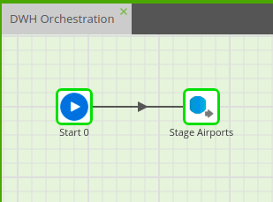
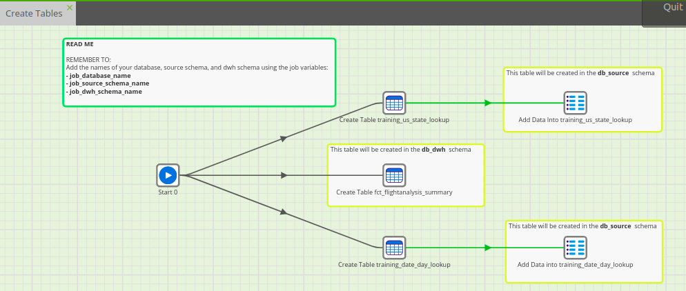
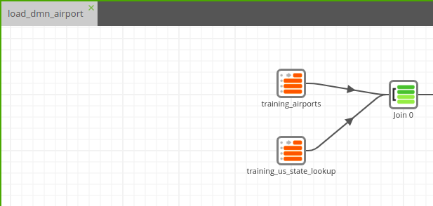
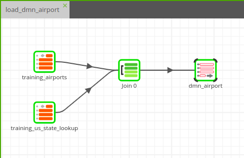

# Level 1

### _Section 1_:

1. Stage Airports Data Using the RDS Query Component.
   

       ● Component Used: Using RDS Query (OJ). 

       ● Job Name: DWH Orchestration  

       ● Target Table: public."training_airports"

---
 

### _Section 2_:

1. Data Preparation - Create Tables

       ● Component Used: ◉ Create table (OJ), 
                         ◉ SQL Script (OJ), 

       ● Job Name: Create Tables

       ● Target Table: ◉ db_source."training_date_day_lookup"
                       ◉ db_source."training_us_state_lookup"
                       ◉ db_dwh."fct_flightanalysis_summary"

 

2. Join Each Airport to its US State

       ● Component Used: ◉ Table Input (TJ), 
                         ◉ Join (TJ)  

       ● Job Name: load_dmn_airport 

       ● Target Table:

---
 

### _Section 3_:

1. Create the Airports Dimension Table

       ● Component Used: Rewrite Table (TJ), 

       ● Job Name: load_dmn_airport 

       ● Target Table: db_dwh."dmn_airport"

---
 
