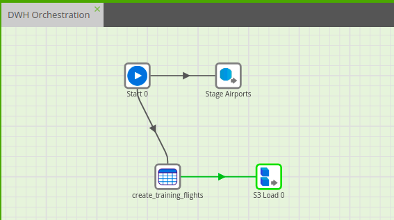
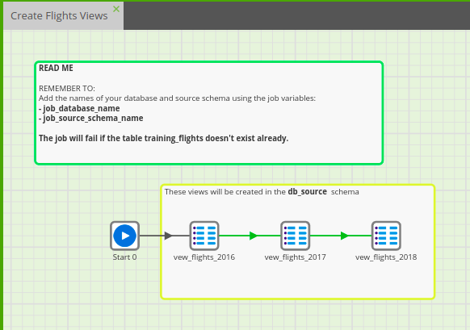
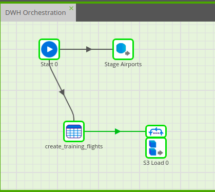
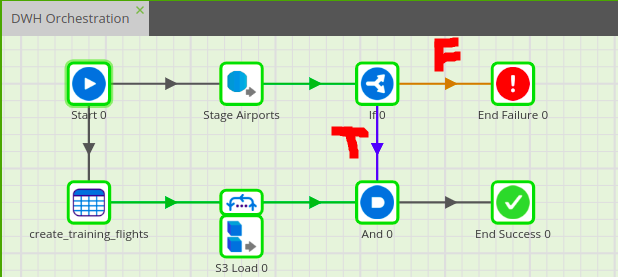
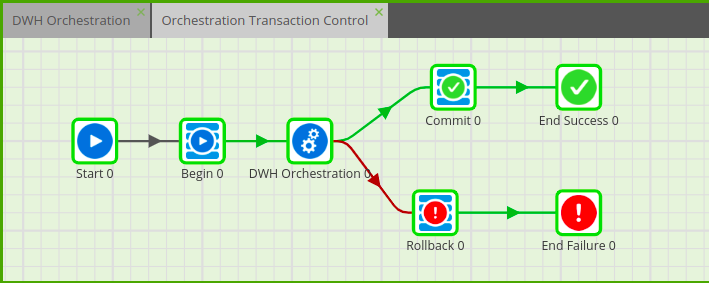
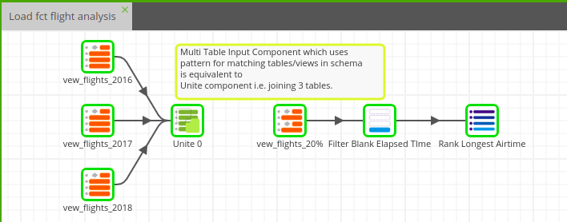
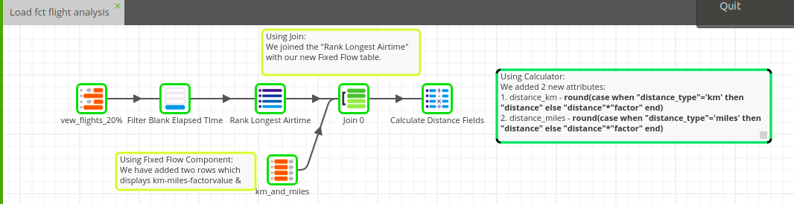
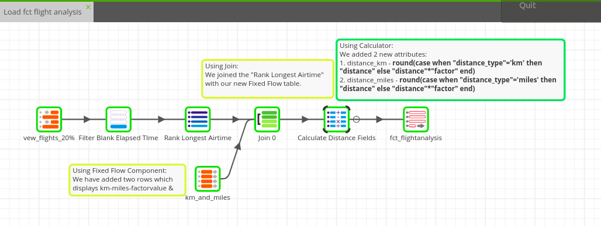
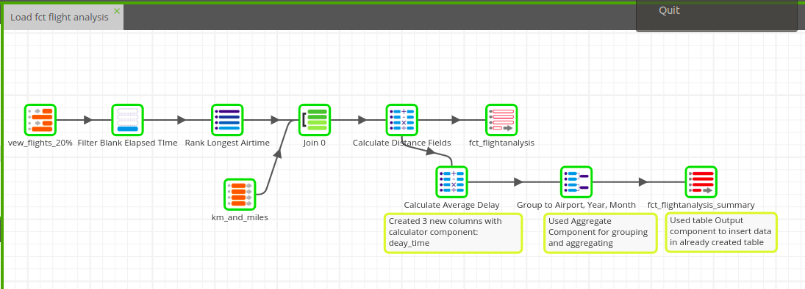

# Level 2

### _Section 1_:

1. Load Flights Data Using the S3 Load Generator Component

        ● Component Used: S3 Load Generator (OJ).
                            ◉ It creates a create table and S3 load component.

        ● Job Name: DWH Orchestration  

        ● Target Table: db_source."training_flights"

---
 

### _Section 2_:

1. Data Preparation - Create Views

        ● Component Used: SQL Script (OJ)

        ● Job Name: Create Flights View 

        ● Target View: ◉ db_source."vew_flights_2016"
                       ◉ db_source."vew_flights_2017"
                       ◉ db_source."vew_flights_2018"    

 

2. Load Multiple Flights Data Files Using the Fixed Iterator Component

        ● Component Used: Fixed Iterator (OJ)
                          ◉ Used Environment Variable and gave values 2016, 2017, 2018.
                          ◉ Used the env variable in s3 path to load files in iteration to table.

        ● Job Name: DWH Orchestration   

        ● Target Table: db_source."training_flights"
 

---
 

### _Section 3_:

1. Control Business Logic with Logical Operators

        ● Component Used: 
              ◉ If,
              ◉ And,
              ◉ End Failure,
              ◉ End Success

        ● Job Name: DWH Orchestration   
    

---
 

### _Section 4_:

1. Control Business Logic with Transactions

        ● Component Used: 
            ◉ Begin - indicates the point where the transaction starts.
            ◉ Commit
            ◉  Rollback

        ● Job Name: Orchestration Transaction Control

 

2. Schedule a Job

 
        ● Job Name: DWH Orchestration 

---
 

### _Section 5_:

1. Cleanse Data and Rank Flights Based on Their Airtime

        ● Component Used: 
            ◉ Input Table (pointing to views/tables)
            ◉ Unite
            ◉ Multi Table Input 
            ◉ Filter
            ◉ Rank

        ● Job Name: Load fct flight analysis (TJ)
    

---
 

### _Section 6_:

1. Convert Distances Using The Fixed Flow Component

        ● Component Used:
            ◉ Fixed Flow
            ◉ Join
            ◉ Calculator

        ● Job Name: Load fct flight analysis (TJ)

---
 

### _Section 7_:

1. Create the Fact Table For Flight Analysis

        ● Component Used: Rewrite Table

        ● Job Name: Load fct flight analysis (TJ)

---
 

### _Section 8_:

1. Load Data Into The Fact Table And Calculate the Average Delay Per Flight

        ● Component Used: 
            ◉ Calculator
            ◉ Aggregate
            ◉ Table Output

        ● Job Name: Load fct flight analysis (TJ)

