# Level 3

### _Section 1_:

1. Create a Date Dimension From a Sequence of Numbers

        ● Component Used:  ◉ Generate Sequence
                           ◉ Calculator

        ● Job Name: Load dmn date (TJ) 

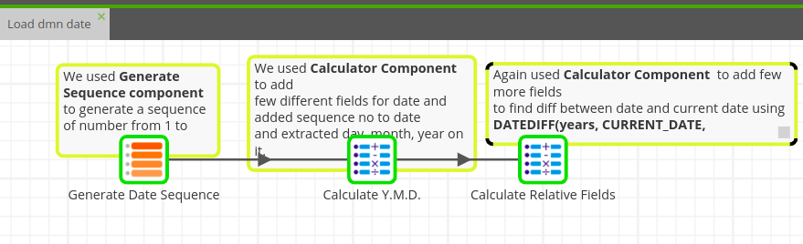
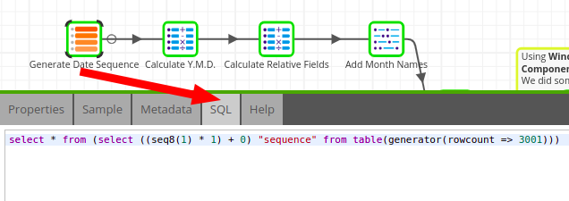

---
 

### _Section 2_:

1. Add Month Names and Days of the Week to the Date Dimension

        ● Component Used:  ◉ Map Values
                           ◉ Table Input
                           ◉ Transpose Columns
                           ◉ Convert Type
                           ◉ Join

        ● Job Name: Load dmn date (TJ) 

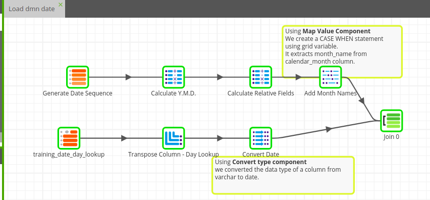
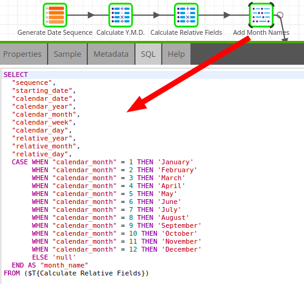
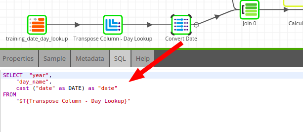

---
 

### _Section 3_:

1. Calculate Days Per Month and Tidy Up Output Data

        ● Component Used:  ◉ Windows Calculation
                           ◉ Rename
                           ◉ Rewrite Table

        ● Job Name: Load dmn date (TJ) 

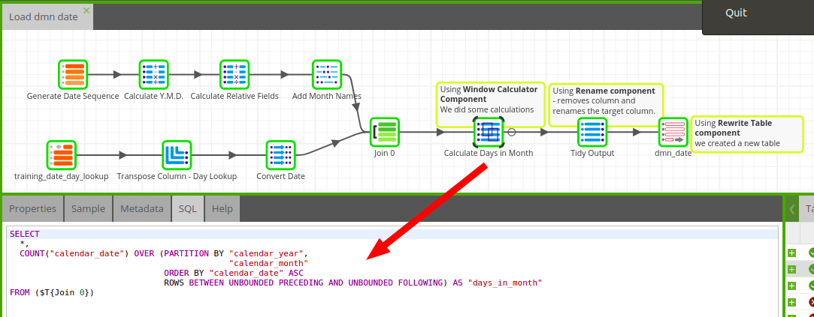

---
 

### _Section 4_:

1. Interact with the AWS Console
    
    Understand what CloudWatch & SQS are.

---
 

### _Section 5_

1. Move Files, Write a Python Script and Use Password Manager
   NEXT

        ● Component Used:  ◉ Data Transfer
                           ◉ Excel Query
                           ◉ Python Script

        ● Job Name: DWH Orchestration (OJ) 

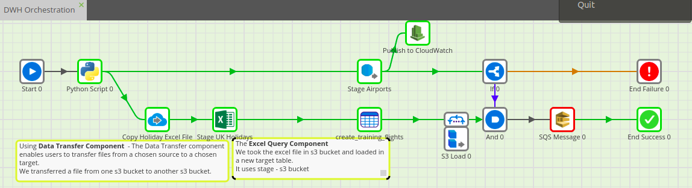
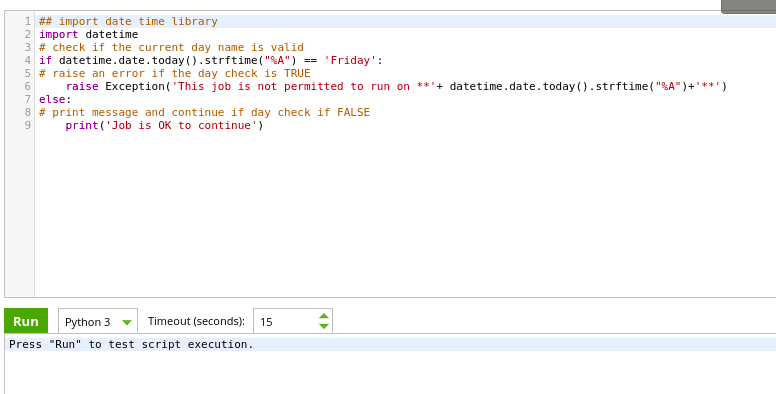

---
 

### _Section 6_

1. Add UK Holidays to the Date Dimension

        ● Component Used:  SQL

        ● Job Name: Load_dmn_date (TJ) 

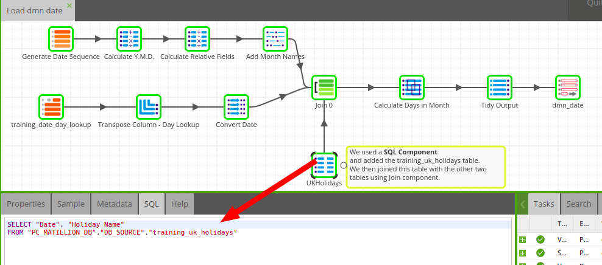

---
 

### _Section 7_

1. Use Extract to New Job Feature to Reorganise Business Logic

        ● Component Used: API Query

        ● Job Name: DWH Orchestration (OJ) 

        ● Target Table: db_source."training_airport_changes"

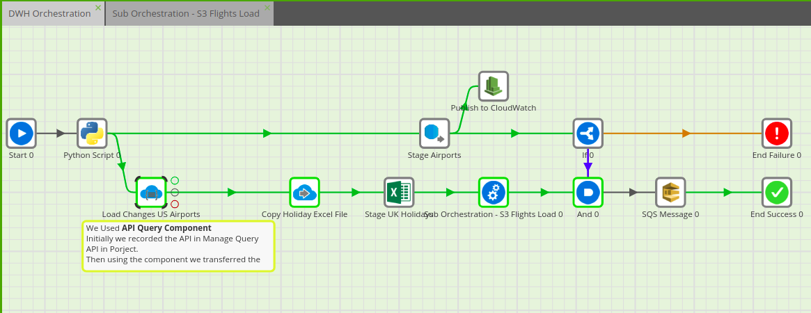

---
 

### _Section 8_

1. Detect Changes in the Airports Data

        ● Component Used: ◉ Input Table
                          ◉ Convert Type
                          ◉ Detect Changes
                          ◉ Aggregate

        ● Job Name: Load dmn_airport(with changes) (TJ) 

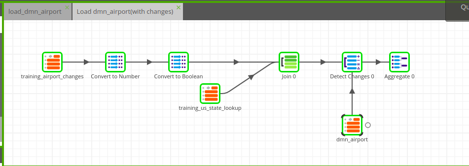

---
 

### _Section 9_

1. Update Dimension Tables with New Changes

        ● Component Used: ◉ Filter
                          ◉ Calculator
                          ◉ Table Output
                          ◉ Table Update
 
        ● Job Name: Load dmn_airport(with changes) (TJ) 

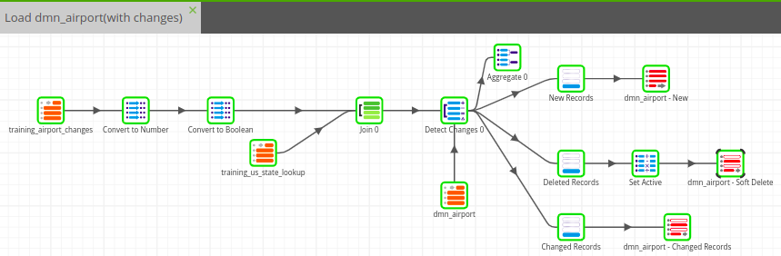

