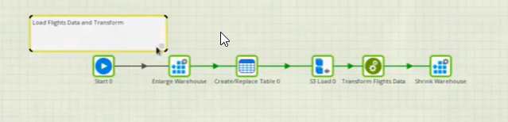
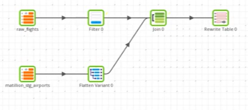

# **First Matillion ETL Job**

- **Orchestration Job:**
    

- **Transformation Job:**  
    

---
 

> ## **Components Used In Orchestration Job**

- Alter Warehouse  
  

- Create Table  
  

- S3_Load  
  

---
 

> ## **Components Used In Transformation Job**

- Table Input  
  

- Filter  
  

- Flatten Variant  
  

- Join  
  

- Rewrite Table  

  - Write the input data flow out to a new table.
  - Output table is overwritten each time the component is executed.

---
 
