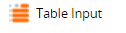

# **Transformation Components**

- ## **Table Input**  

  

  - Reads data from a table.

---

 

- ## **Fixed Flow Component**  

- You can generates fixed set of rows using this component.

---

 

- ## **Multi Table Input Component**  

- Reads data from many input tables based on "Pattern" field where you can provide a pattern for table_name.
- If you prove "20%" in "Pattern" field then it will take all the tables having 20 at the end of their table_name.

---

 

- ## **Table Output**  

- Write an input data flow out to an existing output table.
- It can either append or Truncate+append.

---

 

- ## **Calculator Component**  

  

  - Adds new columns by performing calculations

---

 

- ## **Python Script**  
  
  

  - Run a Python Script in the **Orchestration Job**.
  - Print variables like env_var, job_var, grid_var.
  - Update these variables

---

 
