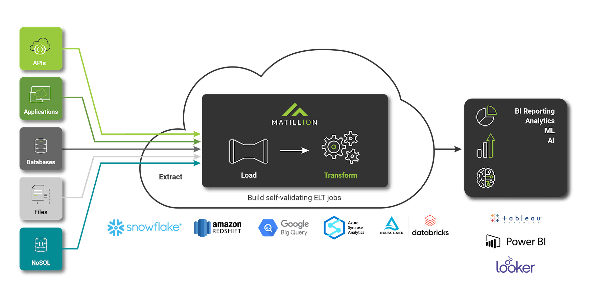

Q. What is Matillion ETL?

    Matillion ETL is an ETL tool that is purpose-built data transformation for cloud data warehouses.

---
 

Q. what cloud Data Warehouse technologies are supported on Matillion?

    Matillion ETL is purpose-built for: 
        ● Snowflake, 
        ● Amazon Redshift, 
        ● Google BigQuery, and 
        ● Microsoft Azure Synapse.

---
 

Q. Matillion ETL Architecture.

---
 

Q. 
